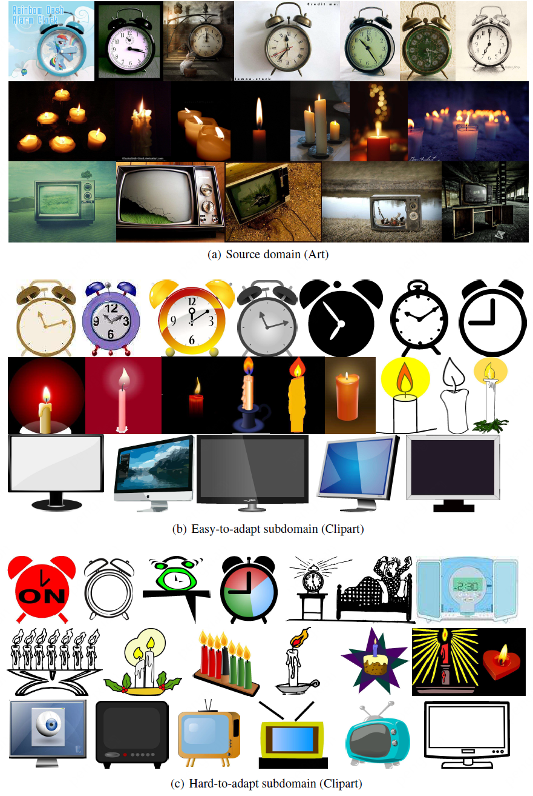

# Divide to Adapt: Mitigating Confirmation Bias for Domain Adaptation of Black-Box Predictors
This repo is the official implementation of ["Divide to Adapt: Mitigating Confirmation Bias for Domain Adaptation of Black-Box Predictors"](https://arxiv.org/abs/2205.14467).
Our method is termed as **BETA**. To cite this work:
```
@article{yang2022divide,
  title={Divide to Adapt: Mitigating Confirmation Bias for Domain Adaptation of Black-Box Predictors},
  author={Yang, Jianfei and Peng, Xiangyu and Wang, Kai and Zhu, Zheng and Feng, Jiashi and Xie, Lihua and You, Yang},
  journal={arXiv preprint arXiv:2205.14467},
  year={2022}
}
```

## News

**2023-01-21**: The paper was accepted by **ICLR 2023** as **spotlight** (notable-top-25%)!

## Environment

1. Install `pytorch` and `torchvision` (we use `pytorch==1.9.1` and `torchvision==0.10.1`).
2. `pip install -r requirements.txt`

## Datasets
Please download and organize the [datasets](https://github.com/jindongwang/transferlearning/blob/master/data/dataset.md) in this structure:
```
BETA
├── data
    ├── office_home
    │   ├── Art
    │   ├── Clipart
    │   ├── Product
    │   ├── Real World
    ├── office31
    │   ├── amazon
    │   ├── dslr
    │   ├── webcam
    ├── visda17
    │   ├── train
    │   ├── validation 
```

Then generate info files with the following commands:
```
python dev/generate_infos.py --ds office_home
python dev/generate_infos.py --ds office31
python dev/generate_infos.py --ds visda17
```

## Train on Office-Home
```
# train black-box source model on domain A
python train_src_v1.py configs/office_home/src_A/train_src_A.py

# adapt with BETA, from A to C
python train_BETA.py configs/office_home/src_A/BETA_C.py

# finetune on C
python finetune.py configs/office_home/src_A/finetune_C.py
```

## Train on Office-31
```
# train black-box source model on domain a
python train_src_v1.py configs/office31/src_a/train_src_a.py

# adapt with BETA, from a to d
python train_BETA.py configs/office31/src_a/BETA_d.py

# finetune on d 
python finetune.py configs/office31/src_a/finetune_d.py
```

## Train on VisDA-2017 
```
# train black-box source model
python train_src_v2.py configs/visda17/train_src.py

# adapt with BETA
python train_BETA.py configs/visda17/BETA.py
```

## Easy-hard domain division
Here we show an example of the easy-hard target domain division (Office-Home: Art -> Clipart).

 
